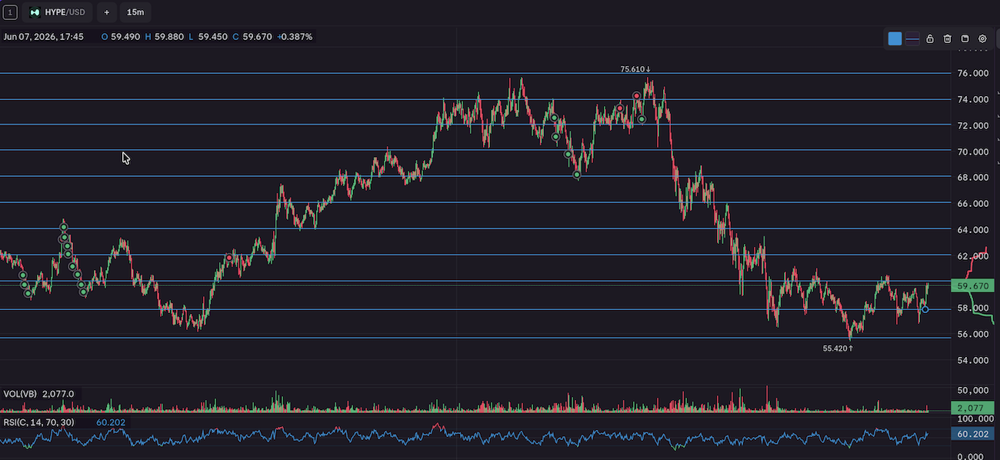
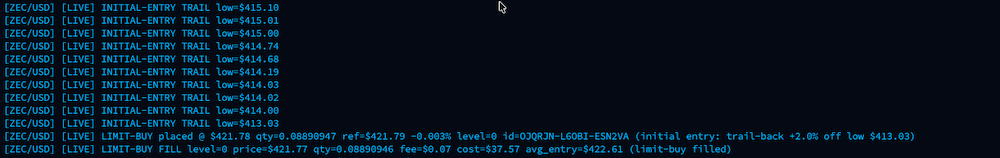
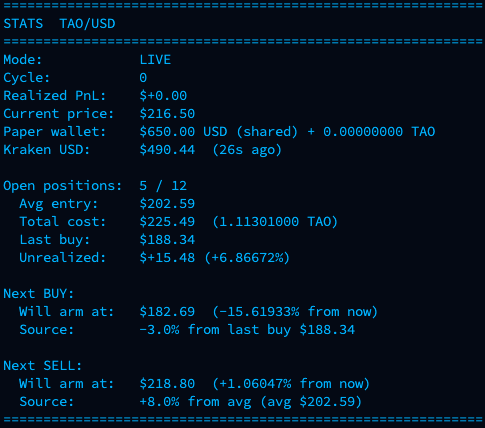

# GridBot

A multi-coin crypto **grid / DCA trading bot** built on [CCXT Pro](https://docs.ccxt.com/) for the **Kraken** exchange.

Each configured coin runs as its own async task with its own live ticker stream, trailing buy/sell state machines, and persisted state file. The bot ladders into a position on dips (DCA grid) and sells the whole position once it reaches a trailing take-profit. It runs in **paper mode by default** and only touches real money when you pass `--live`.

> ⚠️⚠️⚠️ **This bot can place real orders with real money.**⚠️⚠️⚠️ 
- ⚠️ It is a personal project, provided as-is with no warranty. 
- ⚠️ This is not any form or sort of financial advice.  
- ⚠️ Trade at your own risk and test thoroughly in paper mode first.
- ⚠️ Any config included is just an example config.  Change the values as you see fit to the coin.
- ⚠️ My experiences and settings are not advice.
- ⚠️ Make sure to read [Caveats](#caveats) below.

---

## How it works

The bot watches each coin's price tick-by-tick and runs three trailing state machines:

1. **Initial entry** — From a fresh start (no open position) it tracks a running high. When price drops `drop_pct` below that high it *arms* a buy trail, then fires the first buy on a `trail_buy_pct` rebound off the local low. This avoids blindly buying at the top.

2. **Grid buys (DCA)** — After the first position, every time price falls another `drop_pct` below the **last buy price**, it arms another buy trail and buys again on the rebound. Each buy spends `usd_per_buy`, up to `max_grid_levels` total rungs. More rungs = lower average entry.

3. **Sell (take-profit)** — Once price reaches `avg_entry × (1 + take_profit_pct)`, a sell trail arms. When price then pulls back `trail_sell_pct` off its high, the bot **sells the entire position at once**, books realized PnL, and starts a new cycle.

Trailing on both sides means the bot tries to buy after a dip has bounced and sell after a rally has rolled over, rather than firing on the exact threshold.

**Order types** are configurable per coin (`market` or post-only `limit`) for both buys and sells. Resting limit orders are automatically cancelled if price moves away, so a trail can re-arm.

A few extra per-coin behaviors:
- **Breakeven exit** — toggle to sell as soon as price covers average entry + fees (instead of waiting for take-profit). Useful for bailing out of a stuck position at no loss.
- **Pause** — stop opening new buy cycles for a coin (existing position is left intact).
- **Pause-after-sell** — one-shot: finish the current cycle, then pause.

---

## Installation

Requires **Python 3.9+**

```bash
git clone https://github.com/kritch83/GridBot.git
cd GridBot
pip3 install -r helpers/requirements.txt
```

Then create a `.env` file in the project root (see [Configuration](#configuration)) and run:

```bash
python conductor.py
```

---


### Running modes

```bash
python conductor.py              # paper trading (default) — simulated fills, no API keys needed
python conductor.py --live       # LIVE — sends real orders to Kraken (requires API keys)
python conductor.py --live --dry-run   # live code path, but log intended orders instead of sending them
python conductor.py --simulate prices.csv   # replay a CSV of prices (first enabled coin only)
```

### Interactive controls (TTY)

When run in a terminal, the bot has a live keypress menu:

- Press a **digit** to select a coin, which opens its action menu:

  | Key | Action |
  |-----|--------|
  | 1 | live stats |
  | 2 | config |
  | 3 | arm sell-trail |
  | 4 | toggle pause |
  | 5 | toggle breakeven-exit |
  | 6 | toggle pause-after-sell |
  | 7 | **force BUY now** (market) |
  | 8 | **sell ALL now** (market) |
  | 9 | clear stats (full reset) |
  | t | clear targets (reset first-buy to −`drop_pct` from now) |

- **Clear targets** re-baselines the initial-entry reference to the *current* price. Use it when a coin sold near a top and the first-buy target has drifted far below `drop_pct` (e.g. live stats shows "−10.4% from now") because the observed high went stale while the coin was paused or a limit buy was resting. After clearing, the first buy arms at `current_price × (1 − drop_pct)`. It only affects a fresh cycle (no open position) and never cancels resting orders or touches the grid.
- Press **`a`** for an all-coin summary, **`?`** for help, **Ctrl-C** to quit.
- Every action asks for a **`Y`** confirmation except live stats.

### Notifications & dashboard

- **Pushover** — a push notification on every sell (realized PnL %).
- **Blynk Cloud** — pushes per-coin and total realized PnL to virtual pins (`V0` = total, plus each coin's `blynk_pin`) on every sell and on a periodic heartbeat.

Both are optional and silently skipped if their credentials are absent.

---


## Configuration

All tuning lives in **`helpers/config.py`**. 
Secrets live in a project-root **`.env`** file.  You can only read settings from the interactive menu, not write.

### Per-coin settings (`COINS` list)

Each entry in `COINS` is one tracked pair. The bot ships with several examples/configs to test — add, remove, or disable (`"enabled": False`) as you like.

| Field | Meaning |
|-------|---------|
| `symbol` | Kraken pair, e.g. `"BTC/USD"` |
| `price_prec` | Decimal places used when displaying prices |
| `drop_pct` | Spacing between grid buys (e.g. `0.02` = buy again after a 2% drop) |
| `trail_buy_pct` | Rebound off the low required to fire a buy (`0` = buy immediately at the threshold) |
| `take_profit_pct` | How far above average entry to arm the sell trail |
| `trail_sell_pct` | Pullback off the high required to fire the sell |
| `usd_per_buy` | USD spent per grid rung |
| `max_grid_levels` | Max number of rungs (max spend = `usd_per_buy × max_grid_levels`) |
| `buy_order_type` | `"market"` or `"limit"` (default `market`) |
| `order_type` | Sell order type: `"market"` or `"limit"` (default `market`) |
| `limit_buy_offset_pct` | For limit buys: limit price = `bid × (1 − offset)` |
| `limit_sell_offset_pct` | For limit sells: limit price = `ask × (1 + offset)` |
| `enabled` | Whether this coin trades |
| `blynk_pin` | Blynk virtual pin for this coin's realized PnL |

### Global settings (`helpers/config.py`)

| Setting | Default | Meaning |
|---------|---------|---------|
| `EXCHANGE_ID` | `"kraken"` | CCXT exchange id |
| `PAPER_STARTING_USD` | `1800.0` | Shared paper-USD pool across all coins |
| `TAKER_FEE_PCT` | `0.004` | Taker fee used for paper-mode fee math (market orders) |
| `MAKER_FEE_PCT` | `0.002` | Maker fee used for paper-mode fee math (limit fills) |
| `ACTION_COOLDOWN_SEC` | `10.0` | Min gap between order events per coin |
| `LIVE_BUY_FILL_TIMEOUT_SEC` | `15.0` | Max wait for a live market-buy fill before cancelling |
| `PUSHOVER_ENABLED` / `BLYNK_ENABLED` | `True` | Master switches for notifications |

State, the shared wallet, and logs are written under `data/` (`state_<SYMBOL>_<QUOTE>.json`, `wallet.json`, `grid_bot.log`).

### Secrets (`.env` in project root)

Only required for the features you use (`--live` needs the Kraken keys):

```ini
KRAKEN_API_KEY=your_key_here
KRAKEN_API_SECRET=your_secret_here

PUSHOVER_TOKEN=your_token
PUSHOVER_USER=your_user_key
PUSHOVER_SOUND=cashregister

BLYNK_TOKEN=your_blynk_token
```

`.env` is git-ignored. Real environment variables override `.env` values.

---

## Usage Tips 
- Every coin is different - **always do your due diligence for each coin BEFORE going live**
- Before making changes to your config, back up your settings for coin performance comparison.
- Use your exchange's plot tool and make your grid with your drop percent you are testing.  Look and see if you will be hitting the slumps and rallies with the spacing/rounds.  See example calc & image below. 


My method? I find the spacing with this rough formula, making small changes & then testing.


1. (high_price - low_price) / max_grid_levels) = dollars_per_grid.
2. (dollars_per_grid / ((((high_price - low_price) / 2) + low_price))) = **drop_pct**
3. working_money / max_grid_levels = **usd_per_buy**.

To check your values:

- drop_pct * mean price = ~ dollars_per_grid


So if you look at this graph you can see it is hitting the highs and lows with a 3% spacing or about $2.  You want to look at the time scale for how long the high/low cycle is that you are trying to capture.  Your working dollars are going to be divided equally between the grids so ideally, you want it to buy as much as it can and then sell.

If you are working with $600, your grids will be $60 for 10 grids.  Not a ton of profit per buy if it sells at profit but it's something at least!

You need to fall just as much as you need it to rise for the bot to work.  So don't get too discouraged when you are showing negative pnl per coin often.  




Trade offs
- High % drop, fewer buys
- Low % drop, exhausts your grids and you bottom out (running out of grids but price is still falling)
- if the price just keeps dropping & doesn't recover, you are left holding the bag...
- If the price keeps rising, no buys execute or it sells at your set take profit and you miss out on larger profits.
- Trailing is also risky.


Running out of grids is worse than not buying much imo.  Running out will screw it all up.  Trailing helps this. You want it to keep buying as the price drops so it drives down the average buy price & that is what the program is deriving the sell price with.

Let's use an example of a bad setup that I had.  Let's say you have $1000 and you want a good amount to sell each time so you put your grid spacing big with less of them.

BTC price ($72k) is falling & you have 4 grids.  
- it buys at 70k, 68k, 66k & finally at 64k.
- You are done buying, no grids left.

BTC price falls to $55k
- This is bad (obviously for a couple reasons lol)
- Your avg. entry is 67k after all the buys.  That's a ways from the current price @55k.
- Plus if your take profit is 3%, you have even further till it reaches 69.1k and the sell executes.

Same spacing but more grids:
- buys at 70k, 68k, 66k, 64k, 62k, 60k, 58k, & finally 56k
(70+68+66+64+62+60+58+56) / 8 grids = 63k average buy price.  Much closer to your take profit @ 64.89k.  Still far but more likely to sell.


Trailing Settings

To solve the problem of running out of grids & buying/selling at the lowest/highest you can rather than at the exact grid level, trailing is used.  Same example above.  Let's say the price falls past the grid level & a buy is triggered.  If it keeps falling, it will "trail" the price down until it bounces up to your trailing %.

Both good and bad.  Good if it is set right & saves some grids by not buying till it's done falling or rising to lower your entry price. Your average entry is driven down and grids to spare. Bad if the price is falling and not increasing to your bounce back as it falls. Then you could for example end up with buys at 70k, 67k, 63k, 57k, etc...  or in the case of rapid falls, 70k, 55k and that's it.  So now it goes up but you only have two grids so not much profit... assuming it hits your sell %.


Lots to think about...


Here is an example log entry for a buy:


Stat Screen for a coin:


---

## Caveats

- ⚠️ **Real money risk.** In `--live` mode the bot places real orders. There is no warranty; bugs, exchange outages, or bad config can lose money.  Beware. Test extensively in paper mode and start small. Consider `--live --dry-run` first.
- **Sell is all-or-nothing.** A take-profit sells the *entire* position in a single order — there is no laddered/partial exit on the sell side.
- **"Clear stats" does not sell on the exchange.** In live mode, a full reset makes the bot *forget* a tracked position — the actual coins remain in your Kraken account untouched. You must reconcile manually.
- **Tracked position can drift from the exchange.** Kraken deducts trading fees from the received base coin, so the bot's tracked quantity can slightly exceed your real free balance. Live sells are clamped down to the actual free balance to avoid "insufficient funds" errors; the leftover dust is the fee already taken.
- **Paper fills are optimistic.** Paper mode assumes fills at the current bid/ask/limit with no slippage and no partial fills. Live results will differ.
- **Shared paper wallet.** All coins draw from one USD pool, so a large position in one coin reduces what's available to others. If the combined max grid spend exceeds available USD, a warning is logged (but the bot still runs).
- **Interactive menu needs a TTY.** Running headless (e.g. under `nohup`, `systemd`, or in a pipe) disables the keypress controls — the bot trades normally but you can't drive it interactively.
- **Kraken-specific.** The code assumes Kraken conventions (USD/ZUSD balance keys, post-only limit params, market-buy-by-cost). Pointing it at another exchange via `EXCHANGE_ID` may need code changes.
- **`--simulate` runs the first enabled coin only**; other coins are skipped for that run.
- **Fee defaults** (`0.4%` taker / `0.2%` maker) are starting points — set them to match your actual Kraken fee tier so paper PnL is realistic.
- **State files are the bot's memory.** ⚠️ Deleting anything under `data/` resets the bot's view of positions and PnL — ⚠️ it does **not** change what you actually hold on the exchange.
